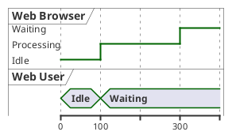
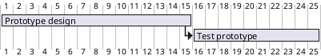

# 详解 jstat 等 Java 工具

* jinfo
* jps
* jstat 
* jcmd
* jmap
* jstack

* jhsdb

## [jinfo](https://docs.oracle.com/javase/10/tools/jinfo.htm#JSWOR744)

生成指定线程的 Java 配置信息，注意：实验性质，未来可能会移除。

使用方式: 

```
jinfo [option] pid
```

参数:

-flag name

打印指定配置项的名字和值

-flag [+|-]name

开启或关闭指定布尔值的配置项

-flag name=value

配置指定配置项的值

-flags

打印虚拟机配置的配置项

-sysprops

打印 Java System Properties

-h or -help

打印帮助信息

例如:

```sh
jinfo -sysprops 5031

Java System Properties:
#Tue Dec 10 16:13:36 CST 2019
gopherProxySet=false
awt.toolkit=sun.lwawt.macosx.LWCToolkit
java.specification.version=11
sun.cpu.isalist=
sun.jnu.encoding=UTF-8
...
```

## [jps](https://docs.oracle.com/en/java/javase/11/tools/jps.html#GUID-6EB65B96-F9DD-4356-B825-6146E9EEC81E)

列出当前系统运行的 JVM 实例

使用方式:

```
jps [ -q ] [ -mlvV ][hostid ]

jps [ -help ]
```

参数:

-q

忽略其它信息，只打印 JVM 实例 id

-mlvV

-m 显示主方法的参数名

-l 显示主方法所在类的全限定名称

-v 显示 JVM 配置的参数

-V 忽略其它信息，只打印 JVM 实例 id (*测试发现这个参数无效，代码显示 showVmFlags，但是结果未显示，代码和文档说的不一致🤷‍♂️*)

hostid

主机标识，参考 `HostIdentifier`

-help

显示帮助信息

### [jstat](https://docs.oracle.com/en/java/javase/11/tools/jstat.html#GUID-5F72A7F9-5D5A-4486-8201-E1D1BA8ACCB5)

监控 JVM 运行状态

使用方式:

```sh
jstat generalOptions

jstat -outputOptions [ -t] [-hlines] vmid [interval [count] ]
```

参数:

这个命令参数较为复杂，因此只选择较为常用的进行介绍，更多内容可查看官方文档和源码。

outputOptions 为输出内容，如`class`,`compiler`,`gccapacity`,`gc`等。

-t 显示该行数据对应的时间戳，以 JVM 启动时间为基准。

vmid 为 JVM 实例 id

interval 数据刷新间隔时间，默认为 ms，也可配置为 s

count 数据显示数量，即执行数据刷新次数

示例:

**class**

查看线程64434的类加载器的状态，执行4次，每次间隔250ms，结果如下：

```
$ jstat -class -t  64434 250 4 
Timestamp       Loaded  Bytes  Unloaded  Bytes     Time
        19001.3   4087  8386.8        0     0.0       1.29
        19001.6   4087  8386.8        0     0.0       1.29
        19001.8   4087  8386.8        0     0.0       1.29
        19002.1   4087  8386.8        0     0.0       1.29
```

可以看到，类加载器共加载了4087个类，总大小为8386KB，类卸载数目为0，释放空间为0KB，执行类加载和卸载消耗时间为1.29ms

**gcutil**

查看线程64434的 gc 简况，执行4次，每次间隔250ms，结果如下：

```
$ jstat -gcutil -t 64434 250 4
Timestamp         S0     S1     E      O      M     CCS    YGC     YGCT    FGC    FGCT    CGC    CGCT     GCT
        19574.7   0.00 100.00   9.76   8.20  96.37  91.43      3    0.011     0    0.000     2    0.001    0.012
        19575.0   0.00 100.00   9.76   8.20  96.37  91.43      3    0.011     0    0.000     2    0.001    0.012
        19575.2   0.00 100.00   9.76   8.20  96.37  91.43      3    0.011     0    0.000     2    0.001    0.012
        19575.5   0.00 100.00   9.76   8.20  96.37  91.43      3    0.011     0    0.000     2    0.001    0.012
```

S0 为 from 空间的空间利用率，S1 为 to 空间的空间利用率，E 为 eden 空间的空间利用率，O 为老生代的空间利用率，M 为元数据空间的空间利用率，CCS 为类指针压缩率，YGC 为新生代发生 GC 事件的次数，YGCT 为新生代 GC 消耗的时间，FGC 为发生 Full GC 事件的次数，FGCT 为 Full GC 消耗的时间，CGC 为并行 GC 次数，CGCT 为并行 GC 消耗时间，GCT 为 gc 总消耗时间



