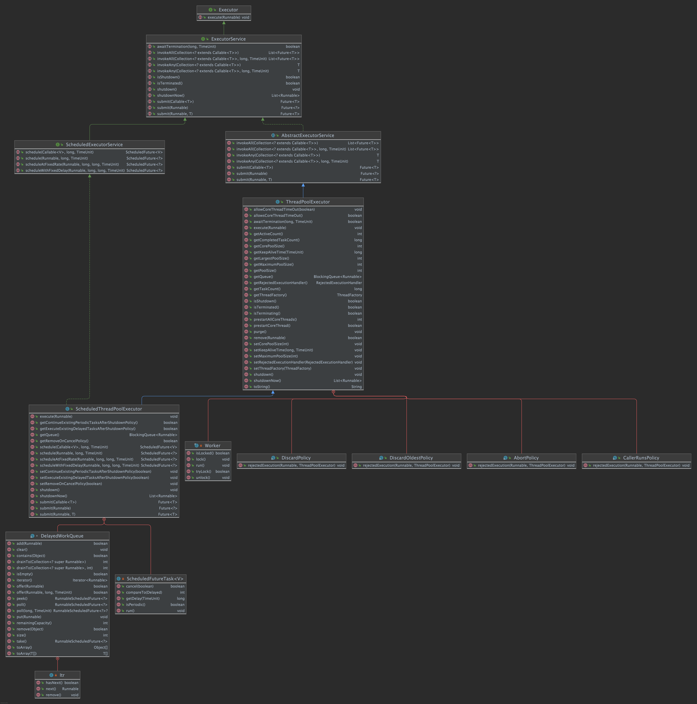

## CyclicBarrier

多个线程等待到达某一状态，可重复使用, `reset`方法。并支持到达等待状态时触发预定义的行为

通过`ReentrantLock`实现等待

```java
/**
 * Main barrier code, covering the various policies.
 */
private int dowait(boolean timed, long nanos)
    throws InterruptedException, BrokenBarrierException,
            TimeoutException {
    final ReentrantLock lock = this.lock;
    lock.lock();
    try {
        final Generation g = generation;

        if (g.broken)
            throw new BrokenBarrierException();

        if (Thread.interrupted()) {
            breakBarrier();
            throw new InterruptedException();
        }

        int index = --count;
        if (index == 0) {  // tripped
            boolean ranAction = false;
            try {
                final Runnable command = barrierCommand;
                if (command != null)
                    command.run();
                ranAction = true;
                nextGeneration();
                return 0;
            } finally {
                if (!ranAction)
                    breakBarrier();
            }
        }

        // loop until tripped, broken, interrupted, or timed out
        for (;;) {
            try {
                if (!timed)
                    trip.await();
                else if (nanos > 0L)
                    nanos = trip.awaitNanos(nanos);
            } catch (InterruptedException ie) {
                if (g == generation && ! g.broken) {
                    breakBarrier();
                    throw ie;
                } else {
                    // We're about to finish waiting even if we had not
                    // been interrupted, so this interrupt is deemed to
                    // "belong" to subsequent execution.
                    Thread.currentThread().interrupt();
                }
            }

            if (g.broken)
                throw new BrokenBarrierException();

            if (g != generation)
                return index;

            if (timed && nanos <= 0L) {
                breakBarrier();
                throw new TimeoutException();
            }
        }
    } finally {
        lock.unlock();
    }
}
```

## CountDownLatch

多个线程等待到达某一状态，不可重复使用

内部通过自定义`Sync extends AbstractQueuedSynchronizer`实现

## Semaphore

自定义`Sync extends AbstractQueuedSynchronizer`，通过分发许可的方式实现，如果可获取到许可则正常执行，没有许可分发则进入等待状态，等待有可用许可即其它任务释放许可。常用于实现线程池等有限资源分发的环境中。没有可重入设计，即不会和线程绑定，可用来恢复线程死锁。支持公平和非公平两种状态

> Each acquire blocks if necessary until a permit is available, and then takes it. Each release adds a permit, potentially releasing a blocking acquirer.

`FairSync`首先调用`hasQueuedPredecessors()`判断是否已有线程在等待，有的话则进入等待状态，否则进入"CAS"。`NonfairSync`直接进入"CAS"进行"Acquire"

## Phaser

> A reusable synchronization barrier, similar in functionality to CyclicBarrier and CountDownLatch but supporting more flexible usage.

类似`CyclicBarrier`但是具有更强的定制性, 通过 `ForkJoinPool` 实现, 需要了解更多知识

***实现过于复杂，目前看的云里雾里，很多东西不理解，需要逐步了解相关知识***

[Guide to the Java Phaser](https://www.baeldung.com/java-phaser)

## ThreadLocal

## Executor



#### java.util.concurrent.ThreadPoolExecutor
