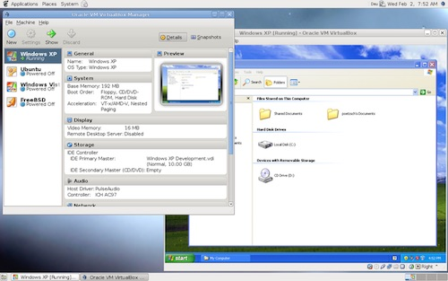
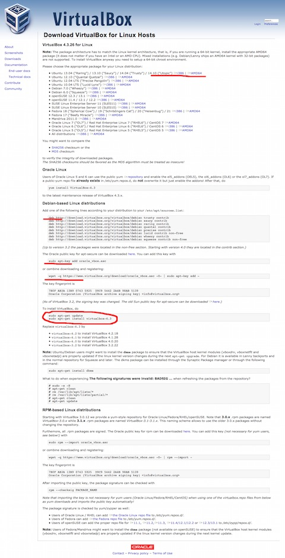

#VirtualBox的简单介绍和安装

在这篇文章,我们来看看VirtualBox的相关知识和如何安装。   
不知道大家对虚拟机了解多少,不过要想学习linux技术,至少得对虚拟技术有所了 解,这样才可以毫无顾忌的尝试各种操作系统和系统级操作,不用担心会对电脑有什么 损坏。简单来说,虚拟机就像沙盒一样,无论你在其中做了什么样的操作,都不会对 host产生任何影响,另外操作也是可逆的,你可以恢复到操作之前的环境。虚拟机有很 多种,也分为几类,如果大家感兴趣,可以自己去查资料。在这儿我们只了解VirtualBox 的相关知识,另外,在以后的博客中,会对VMware的安装使用技巧做一个简单的介绍。 这是百度百科对“虚拟化技术”的介绍:[链接](http://baike.baidu.com/link?url=ZhG2VRCgD1re7N1RAKLKC0roPSutPnNxWrh0q6R_froicCYAr_AAMBckwqvmJyQ7y_W-Te_wIBJx0xNjNwS-7K)。

>VirtualBox is a powerful x86 and AMD64/Intel64virtualization product for enterprise as well as home use.Not only is VirtualBox an extremely feature rich, high performance product for enterprise customers,it is also the only professional solution that is freely available as Open Source Software under the terms of the GNU General Public License (GPL) version 2. See "About VirtualBox" for an introduction.

上面的的英文是VirtualBox的官网的介绍。VirtualBox是一个开源的虚拟机软件,它是属于寄居架构虚拟机,不能直接运行在硬件上,只能运行在操作系统上。在操作系统上安 装好VirtualBox之后,可以通过VirtualBox来安装操作系统,从而达到自己的目的。下面我们直接来看如何在ubuntu上安装VirtualBox。


**(1)手动安装:**   

1. 下载VirtualBox:https://www.virtualbox.org/wiki/Linux_Downloads,根据自己的系
统版本来选择对应的软件版本,下载的软件包为.deb文件。

2. 双击下载好的软件包,通过软件中心来安装,如果提示“没有权限”的话,使用

		sudo chmod +x *.deb
把上面的“**”替换成下载好的软件包名,来添加执行权限。添加执行权限之后,再次用软件中心打开,点击“安装” 即可。

**(2)自动安装:**

1. 打开软件中心,搜索VirtualBox,点击下载即可,一般是旧版本。

**(3)添加VirtualBox的软件源来安装最新版的VirtualBox:**

1. 通过以上方式安装的版本比较旧,可以通过添加VirtualBox的软件源来安装最新版的 软件包:打开https://www.virtualbox.org/wiki/Linux_Downloads,我们可以看到   
   
因为使用的是Ubuntu 14.04,ubuntu是“Debian-based Linux distributions”,所以使用软件中心来 添加

        deb http://download.virtualbox.org/virtualbox/debian trusty contrib
	
2. 添加好之后,下载秘钥

		wget -q https://www.virtualbox.org/download/oracle_vbox.asc -O- | sudo apt-key add -
		
3. 更新软件源

		sudo apt-get update
	
4. 安装

		sudo apt-get install virtualbox-4.3
	
这样,软件就安装好,可以通过virtualbox来尝试各种操作系统和软件了。